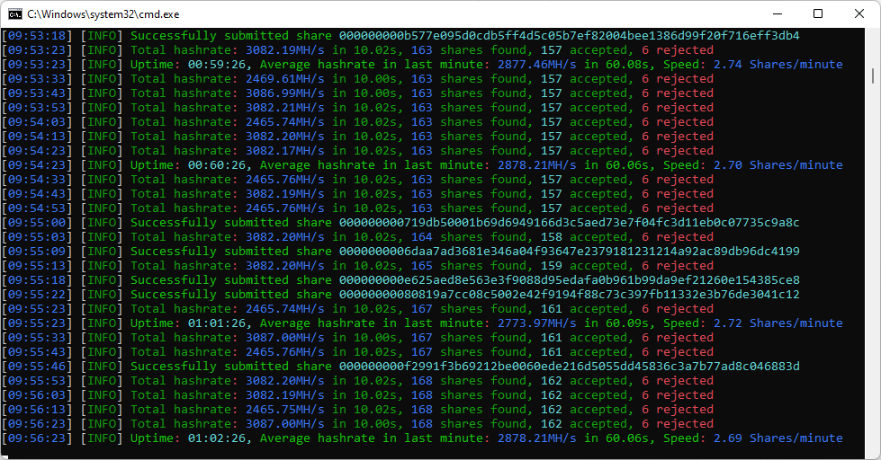

# [TON Miner](https://github.com/MPCodeWriter21/miner)

## Instructions

Download the latest release of our miner at https://github.com/MPCodeWriter21/miner/releases , then run the
corresponding command according to your operating system.

```
# Windows
miner-windows.exe run https://next.ton-pool.club <your_wallet>

# Linux
./miner-linux run https://next.ton-pool.club <your_wallet>
```

If you have updated your hardware settings (like overclocking) or if you accidentally run our miner twice, make sure to
delete `benchmark_data.txt` before running it again to get optimal hashrate.

### Hive OS Configuration

Installation URL: go to [releases](https://github.com/TON-Pool/miner/releases), copy the link of any `hiveos` file.

Wallet and worker template: `%WAL%`

Pool URL: https://next.ton-pool.club

Note: The hashing algorithm will show up as darkcoin in the panel, although it is not actually.

### Rave OS Configuration

Go to [releases](https://github.com/TON-Pool/miner/releases), download a RaveOS package, and upload it to custom miners.

Create a new wallet, select our mining pool, and the newly uploaded miner, and you're ready to start mining.

### Screenshots



### Troubleshooting

If miner is not working properly, you can describe the problem you are experiencing
in [issues](https://github.com/MPCodeWriter21/miner/issues), and attach a screenshot of miner output, as well as your
configuration information (graphics card model, operating system, etc.)

Here are also some common problems and corresponding solutions.

#### It doesn't work properly on my AMD GPU

We are working on this.

#### I can't connect to pool

We have two mining domains, `https://next.ton-pool.com` and `https://next.ton-pool.club`. If any domain doesn't work,
please try to switch to the other one.

#### I see twice as many cards in the output

Try to add argument `-p 0`.

## Run Python code

If you want to debug the miner, you can run the Python code directly.

You need to have Python 3 and packages `pyopencl`, `numpy`, `requests`, `websocket-client` and `log21` installed.

For Linux users, you can run `pip3 install pyopencl numpy requests websocket-client log21` to install the packages. If
you are running old version of Python, try `pip3 install "pyopencl<2018.3"` and `pip3 install "numpy<1.15"`.

For Windows users, you can run `pip3 install numpy requests websocket-client log21` to install the later two packages.
You need to go to https://www.lfd.uci.edu/~gohlke/pythonlibs/#pyopencl and download an `pyopencl` binary.

The command is

```
python3 miner.py [pool addr] [wallet address]
```

## Dev Fee

You are allowed to use our miner in any mining pool, but if you don't use [TON-Pool.com](https://ton-pool.com/), then 1%
of your income will be donated to the developers.

## License

GPLv3
